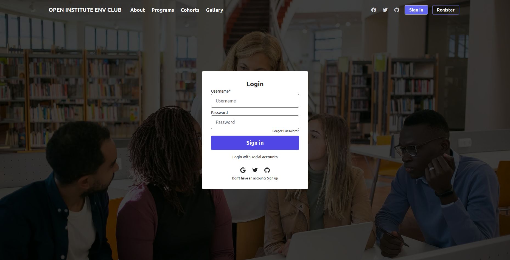
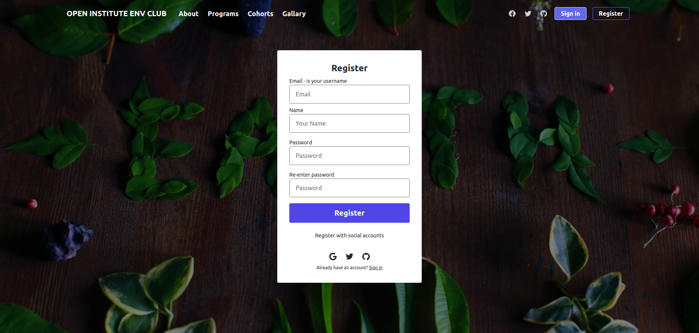
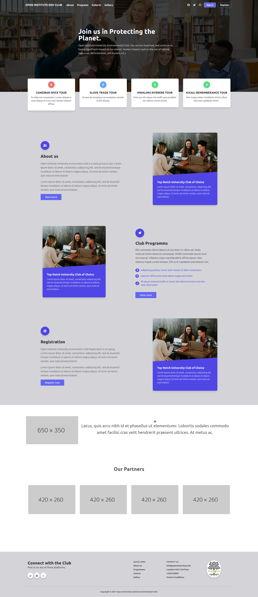

# open-institute-env-club

# Login page
 



# Register page



# Homepage
 



# Open Institute University Environmental Club

## Introduction

> This is a test  app for Open Institute University Environmental Club

## Code Samples

> This web application is developed in Vue.js  and Tailwinds css. It use Google Firebase for Authentication
It also uses a local Json file as a database

## Login Requirements:
> just use your email and password to  register 
> and use the same details for  login

 
## Build Setup

``` bash
# clone
git clone https://github.com/migoya2020/open-institute-env-club.git

# install dependencies
cd open-institute-env-club 
npm install

# serve with hot reload at localhost:8080
npm run dev

# build for production with minification
npm run build

# build for production and view the bundle analyzer report
npm run build --report

# run unit tests
npm run unit

# run all tests
npm test
```
